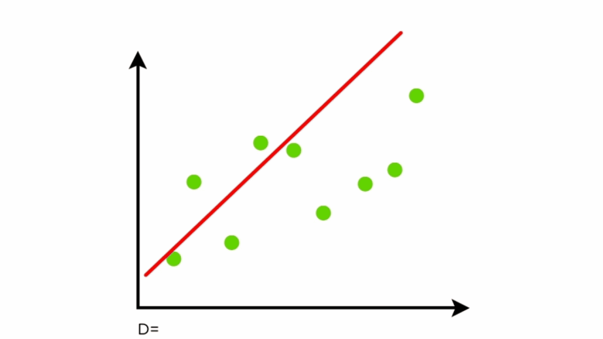

<style type="text/css">

/* Table of content - navigation */
div#TOC li {
    list-style:none;
    background-color:lightgray;
    background-image:none;
    background-repeat:none;
    background-position:0;
    font-family: Arial, Helvetica, sans-serif;
    color: #780c0c;
}


/* Title fonts */
h1.title {
  font-size: 24px;
  color: darkblue;
  text-align: center;
  font-family: Arial, Helvetica, sans-serif;
  font-variant-caps: normal;
}
h4.author { 
  font-size: 18px;
  font-family: Arial, Helvetica, sans-serif;
  color: navy;
  text-align: center;
}
h4.date { 
  font-size: 18px;
  font-family: Arial, Helvetica, sans-serif;
  color: darkblue;
  text-align: center;
}

/* Section headers */
h1 {
    font-size: 22px;
    font-family: "Times New Roman", Times, serif;
    color: darkred;
    text-align: left;
}

h2 {
    font-size: 18px;
    font-family: "Times New Roman", Times, serif;
    color: navy;
    text-align: left;
}

h3 { 
    font-size: 15px;
    font-family: "Times New Roman", Times, serif;
    color: darkred;
    text-align: left;
}

h4 {
    font-size: 18px;
    font-family: "Times New Roman", Times, serif;
    color: darkred;
    text-align: left;
}

/* Decoration of hyperlinks  */

/* unvisited link */
a:link {
  color: green;
}

/* visited link */
a:visited {
  color: purple;
}

/* mouse over link */
a:hover {
  color: red;
}

/* selected link */
a:active {
  color: yellow;
}
</style>

```{r setup, include=FALSE}
# code chunk specifies whether the R code, warnings, and output 
# will be included in the output files.
if (!require("gapminder")) {
   install.packages("gapminder")
   library(gapminder)
}
if (!require("tidyr")) {
   install.packages("tidyr")
   library(tidyr)
}
if (!require("tidyverse")) {
   install.packages("tidyverse")
   library(tidyverse)
}
if (!require("knitr")) {
   install.packages("knitr")
   library(knitr)
}
if (!require("cowplot")) {
   install.packages("cowplot")
   library(cowplot)
}
if (!require("latex2exp")) {
   install.packages("latex2exp")
   library(latex2exp)
}
if (!require("plotly")) {
   install.packages("plotly")
   library(plotly)
}
if (!require("gapminder")) {
   install.packages("gapminder")
   library(gapminder)
}
if (!require("png")) {
    install.packages("png")             # Install png package
    library("png")
}
if (!require("RCurl")) {
    install.packages("RCurl")             # Install RCurl package
    library("RCurl")
}
if (!require("colourpicker")) {
    install.packages("colourpicker")              
    library("colourpicker")
}
if (!require("gganimate")) {
    install.packages("gganimate")              
    library("gganimate")
}
if (!require("gifski")) {
    install.packages("gifski")              
    library("gifski")
}
if (!require("magick")) {
    install.packages("magick")              
    library("magick")
}
if (!require("grDevices")) {
    install.packages("grDevices")              
    library("grDevices")
}
if (!require("jpeg")) {
    install.packages("jpeg")              
    library("jpeg")
}
if (!require("VGAM")) {
    install.packages("VGAM")              
    library("VGAM")
}
if (!require("MASS")) {
    install.packages("MASS")              
    library("MASS")
}
if (!require("nnet")) {
    install.packages("nnet")              
    library("nnet")
}
if (!require("cluster")) {
    install.packages("cluster")              
    library("cluster")
}
if (!require("dplyr")) {
    install.packages("dplyr")              
    library("dplyr")
}
if (!require("odbc")) {
   install.packages("odbc")
   library(odbc)
}
if (!require("DBI")) {
   install.packages("DBI")
   library(DBI)
}
if (!require("RSQLite")) {
   install.packages("RSQLite")
   library(RSQLite)
}

if (!require("tidyverse")) {
   install.packages("tidyverse")
   library(tidyverse)
}
if (!require("data.table")) {
   install.packages("data.table")
   library(data.table)
}


# knitr::opts_knit$set(root.dir = "C:\\STA490\\w05")
knitr::opts_chunk$set(echo = TRUE,       
                      warning = FALSE,   
                      result = TRUE,   
                      message = FALSE,
                      comment = NA)

db <- dbConnect(RSQLite::SQLite(), dbname = "sql.sqlite")
knitr::opts_chunk$set(connection = "db")


```


# Introduction 

Linear regression is one of the simplest predictive modeling algorithms that can predict the value of the dependent variable by considering only one independent variable. The variable to be predicted is called the dependent variable. The variable used to predict the value of another variable is called the independent variable.


# Defination

Linear regression is an algorithm that shows a linear relationship    between an independent variable and a dependent variable.


```{r ,echo = FALSE}
knitr:: 
```


# Mathematical Formulas

Y is dependent variable
β0 is bias term
β1,β2,...βn are coefficient
x1,x2,...xn are independent variable
ε is random error

An example of inline equation $y=\beta_0+\beta_1x_1+\cdots+\beta_kx_k+\epsilon$, where $\epsilon \sim N(0, \sigma^2)$.

#  Assumptions associated with a linear regression model

- Linearity: The relationship between X and the mean of Y is linear.
- Homoscedasticity: The variance of residual is the same for any value of X.
- Independence: Observations are independent of each other.
- Normality: For any fixed value of X, Y is normally distributed.


# Case example 1 Raw Data Table   

```{r}
penguins = read.csv("https://raw.githubusercontent.com/GUANTSERN-KUO/webcv/main/w03/w03-penguins.csv")

penguins.new <- na.omit(penguins)
 
penguins.new = 
  filter(penguins.new, (species == "Adelie" | species == "Gentoo")
            & (island == "Biscoe" | island == "Torgersen" ) 
            & (5000 > body_mass_g & body_mass_g > 3500) )

penguins.new$BMI <- penguins.new$body_mass_g/(4000)

penguins.new <- subset(penguins.new, select = -c(X,body_mass_g,sex,year ))

``` 
 


```{r eval=requireNamespace("DT", quietly=TRUE), echo=FALSE}
DT::datatable((penguins.new), fillContainer = FALSE, options = list(pageLength = 6))


```

## Descriptive Statistic & Variables Relationship 

- flip : Penguins flipper length (mm)
- bill : Penguins bill length (mm)
- BMI: Penguins body mass / 4000 (grams)


```{r}
flip = summary(penguins.new$flipper_length_mm )

bill = summary(penguins.new$bill_length_mm )
BMI = summary(penguins.new$BMI )


list(flip = flip, bill = bill, BMI=BMI)

pen <- c("flipper_length_mm", "bill_length_mm", "BMI")
DB <- penguins.new[pen]
pairs(DB)
```

- flipper_length_mm : Penguins flipper length (mm)
- bill_length_mm : Penguins bill length (mm)
- BMI: Penguins body mass / 4000 (grams)

From the above figure, it is positive linear relationship between flipper_length_mm and BMI. Moreover, it is positive linear relationship between bill_length_mm and BMI. 

##   The relationship between Bill legnth and Flipper length across 2 species

```{r}

 
pg.img <- "https://raw.githubusercontent.com/GUANTSERN-KUO/webcv/main/w03/img2/penguin.jpeg"
my.pg <- readJPEG(getURLContent(pg.img))
raster.pg <- as.raster(my.pg)

# Use the code in the precious section
Bill.length = penguins.new$bill_length_mm
Flipper.length = as.numeric(penguins.new$flipper_length_mm)
size.body = as.numeric(penguins.new$BMI)

species = penguins.new$species

## identifying the ID 
Adelie.id = which(species=="Adelie")  # value are case sensitive!
Gentoo.id = which(species=="Gentoo")


## making an empty plot: type = "n" ==> no point
plot(Bill.length, Flipper.length, main = "Bill legnth vs Flipper legnth across 2 species", type = "n" ,  xlab = "Bill legnth (mm)", ylab = "Flipper Length (mm)")

points(Bill.length[Adelie.id], Flipper.length[Adelie.id], 
       pch = 19, col = "purple", cex = size.body[Adelie.id])

points(Bill.length[Gentoo.id], Flipper.length[Gentoo.id], 
       pch = 19, col = "navy", cex = size.body[Gentoo.id])


legend("topleft", c("Adelie", "Gentoo"), 
                  col=c("purple", "navy"),
                  pch=c(19, 19))

#rasterImage(raster.pg,57,190,60,220)

# plot a regression line 
abline(lm(Flipper.length[Adelie.id]~Bill.length[Adelie.id]),col='purple') 

abline(lm(Flipper.length[Gentoo.id]~Bill.length[Gentoo.id]),col='navy') 
``` 

From above the figure, most Gentoo penguins have longer flipper and longer bill than Adelie penguins. In addition, there is a positive linear relationship between flipper length and bill length 
in both the Gentoo and Adelie penguin studies.
 
 
 
# Case example 2 Raw Data Table 

## Data Preparation


There are 4 raw data available on the Github website, including incomes file, life expectancy years file, countries total file and population total file. In addition,incomes file, life expectancy years file and population total file have to transpose data files (from wide to long). Then, combine the four files into a final dataset by using PROC SQL.

```{r}
#read data files from GitHub
I.P.P = read.csv("https://raw.githubusercontent.com/GUANTSERN-KUO/webcv/main/w05/income_per_person.csv")

L.E.Y = read.csv("https://raw.githubusercontent.com/GUANTSERN-KUO/webcv/main/w05/life_expectancy_years.csv")


countrytot = read.csv("https://raw.githubusercontent.com/GUANTSERN-KUO/webcv/main/w05/countries_total.csv")


poptot = read.csv("https://raw.githubusercontent.com/GUANTSERN-KUO/webcv/main/w05/population_total.csv")


#transpose data from wide to long

IPPlong <- melt(setDT(I.P.P),value.name = "income", id.vars = c("geo"), variable.name = "year")

LEYlong <- melt(setDT(L.E.Y),value.name = "life_expectancy", id.vars = c("geo"), variable.name = "year")

poptotlong <- melt(setDT(poptot),value.name = "pop_size", id.vars = c("geo"), variable.name = "year")


## remove string X
IPPlong$year<-gsub("X","",as.character(IPPlong$year))
LEYlong$year<-gsub("X","",as.character(LEYlong$year))
poptotlong$year<-gsub("X","",as.character(poptotlong$year))


#merge Income Per Person and Life Expectancy in Years 
LifeExpIncom <- merge(LEYlong, IPPlong, by = c("geo", "year"),
                      all = TRUE)

#Create database
con <- dbConnect(drv = SQLite(),
                 dbname = ":memory:")

#store sample data in database
dbWriteTable(conn = con, 
             name = "LEYlong",
             value = LEYlong)

dbWriteTable(conn = con, 
             name = "IPPlong",
             value = IPPlong)

dbWriteTable(conn = con, 
             name = "LifeExpIncom",
             value = LifeExpIncom)

dbWriteTable(conn = con, 
             name = "countrytot",
             value = countrytot)

dbWriteTable(conn = con, 
             name = "poptotlong",
             value = poptotlong)


```


```{sql, connection = "con", output.var = "life2"} 

SELECT a.*, b.region
FROM LifeExpIncom AS A
LEFT JOIN countrytot AS B
ON A.geo = B.name;


```

```{r}

#store sample data in database
dbWriteTable(conn = con, 
             name = "life2",
             value = life2)

```


```{sql, connection = "con", output.var = "final"} 
SELECT a.*, b.pop_size
FROM life2 AS A
LEFT JOIN poptotlong AS B
ON A.geo = B.geo AND A.year = B.year ;
```

```{r}
# write final data to csv file
write.csv(x = final, file = "final.csv", row.names = FALSE)
```


```{r}

# read final file
final = read.csv("https://raw.githubusercontent.com/GUANTSERN-KUO/webcv/main/w05/final.csv")


data2015 <- filter(final,year==2015)  # create 2015data

data2015$size000 <- data2015$pop_size/20000000 
```


## Descriptive Study Purpose & Variables Relationship 

The study focus on the relationship between income and life expectancy across region in 2015. Secondary understanding of the relationship between income and life expectancy over year in different regions. There are 7 variables in final dataset. 


- geo : geography
- pop_size : population size
- size000 : equivalent ratio to population size

The below is the data table for 2015.

```{r eval=requireNamespace("DT", quietly=TRUE), echo=FALSE}
DT::datatable((data2015), fillContainer = FALSE, options = list(pageLength = 6))


```


```{r}
summary(data2015)

```

People with a maximum income of 120000 and a minimum income of 623 in 2015. Also, in 2015, people's life expectancy index ranged from a high of 83.8 to a low of 49.6.

##   The Distribuition of Region in 2015

Asia has the highest percentage of the world's population (28.5%), with a total of 51 countries. Oceania has the lowest percentage of the world's population (7.26%), with a total of 13 countries.

```{r}
piedata <- filter(data2015,!is.na(region))

piedataf = data.frame(cate =as.vector(unique(piedata$region)), 
                     freq = as.vector(table(piedata$region)))

# define a color vector
colors <- c('rgb(211,94,96)', 'rgb(128,133,133)', 'rgb(144,103,167)')
# make a pie chart
plot_ly(piedataf, 
        labels = ~cate, 
        values = ~freq, 
        type = 'pie',
        textposition = 'inside',
        textinfo = 'label + percent',
        insidetextfont = list(color = '#FFFFFF'),
        #hoverinfo = 'text',
        marker = list(colors = colors,
                      line = list(color = '#FFFFFF', width = 1)),
                      #The 'pull' attribute can also be used to create space between the sectors
        showlegend = TRUE) %>% 
         layout(title = 'Distribution of Region in 2015',
                xaxis = list(showgrid = FALSE, zeroline = FALSE, 
                             showticklabels = FALSE),
                yaxis = list(showgrid = FALSE, zeroline = FALSE, 
                             showticklabels = FALSE),
                      ## margin of the plot
      margin = list(
              b = 50,
              l = 100,
              t = 120,
              r = 50
      ))
```

##   The relationship between Income and Life Expectancy across Region in 2015


Most people in the European region have higher incomes and higher levels of life expectancy. And most people in the African region have lower incomes and lower levels of life expectancy.


```{r}

plot_ly(
    data = data2015,
    x = ~income,  # Horizontal axis 
    y = ~life_expectancy,   # Vertical axis 
    color = ~factor(region),  # must be a numeric factor
    
    #text = ~Species,
    text = ~paste("country name: ", geo,
                   "<br>population size: ", pop_size,
                   "<br>region: ", region), 
     # Show the species in the hover text
     ## using the following hovertemplate() to add the information of the
     ## Two numerical variables to the hover text.
     ### Use the following hover template to display more information
     hovertemplate = paste('<i><b>life expectancy<b></i>: %{y}',
                           '<br><b>income</b>:  %{x}',
                           '<br><b>%{text}</b>'),
     alpha  = 0.6,
     marker = list(size = ~size000, sizeref = .05, sizemode = 'area' ),
     type = "scatter",
     mode = "markers",
     ## graphic size
     width = 700,
     height = 500) %>%
    layout(  
      ### Title 
      title =list(text = "Income vs Life Expectancy in 2015", 
                  font = list(family = "Times New Roman",  # HTML font family  
                                size = 18,
                               color = "red")), 
      ### legend
      legend = list(title = list(text = 'region',
                                 font = list(family = "Courier New",
                                               size = 14,
                                              color = "green")),
                    bgcolor = "ivory",
                    bordercolor = "navy",
                    groupclick = "togglegroup",  # one of  "toggleitem" AND "togglegroup".
                    orientation = "v"  # Sets the orientation of the legend.
                    ),
      ## margin of the plot
      margin = list(
              b = 100,
              l = 100,
              t = 50,
              r = 50
      ),
      ## Background
      plot_bgcolor ='#f7f7f7', 
      ## Axes labels
             xaxis = list( 
                    title=list(text = 'Income',
                               font = list(family = 'Arial')),
                    zerolinecolor = 'red', 
                    zerolinewidth = 2, 
                    gridcolor = 'white'), 
            yaxis = list( 
                    title=list(text = 'Life Expectancy',
                               font = list(family = 'Arial')),
                    zerolinecolor = 'purple', 
                    zerolinewidth = 2, 
                    gridcolor = 'white'),
       ## annotations
       annotations = list(  
                     x = 0.5,   # between 0 and 1. 0 = left, 1 = right
                     y = 1.5,   # between 0 and 1, 0 = bottom, 1 = top
                  font = list(size = 12,
                              color = "darkred"),   
                  text = "The point size is proportional to the population size",   
                  xref = "paper",  # "container" spans the entire `width` of the 
                                   #  lot. "paper" refers to the width of the 
                                   #  plotting area only. yref = "paper",  
                                   #  same as xref.
               xanchor = "center", #  horizontal alignment with respect to its x position
               yanchor = "bottom", #  similar to xanchor  
             showarrow = FALSE)
    
     
    
    ) 

```
##   The relationship between Income and Life Expectancy across Region over the years  

The life expectancy of people in the all regions has increased with each passing year. In 1800, most of Europe had a higher level of life expectancy. However, in 2018, higher levels of life expectancy may come from  multiple regional of country. As can be seen from the figure, there is a positive linear relationship between income and levels of life expectancy across regions.
```{r} 

pal.IBM <- c("#332288", "#117733", "#0072B2","#D55E00", "#882255")
pal.IBM <- setNames(pal.IBM, c("Asia", "Europe", "Africa", "Americas", "Oceania"))

df <- filter(final,!is.na(region))

#df <- final 
fig <- df %>%
  plot_ly(
    x = ~income, 
    y = ~life_expectancy, 
    size = ~(2*log(pop_size)-11)^2,
    color = ~region, 
    colors = pal.IBM,   # custom colors
    #marker = list(size = ~(log(pop)-10),  sizemode = 'area'),
    frame = ~year,      # the time variable to
    # to display in the hover
    text = ~paste("Country:", geo,
                  "<br>Region:", region,
                  "<br>Year:", year,
                  "<br>LifeExp:", life_expectancy,
                  "<br>Pop:", pop_size),
    hoverinfo = "text",
    type = 'scatter',
    mode = 'markers'
  )
fig <- fig %>% layout(
    xaxis = list(
      type = "log"
    ),
    
      title =list(text = "Income vs Life Expectancy over the years", 
                  font = list(family = "Times New Roman",  # HTML font family  
                                size = 18,
                               color = "red")),
    
      xaxis = list( 
                    title=list(text = 'Income',
                               font = list(family = 'Arial')),
                    zerolinecolor = 'red', 
                    zerolinewidth = 2, 
                    gridcolor = 'white'), 
            yaxis = list( 
                    title=list(text = 'Life Expectancy',
                               font = list(family = 'Arial')),
                    zerolinecolor = 'purple', 
                    zerolinewidth = 2, 
                    gridcolor = 'white')
  )

fig
```


