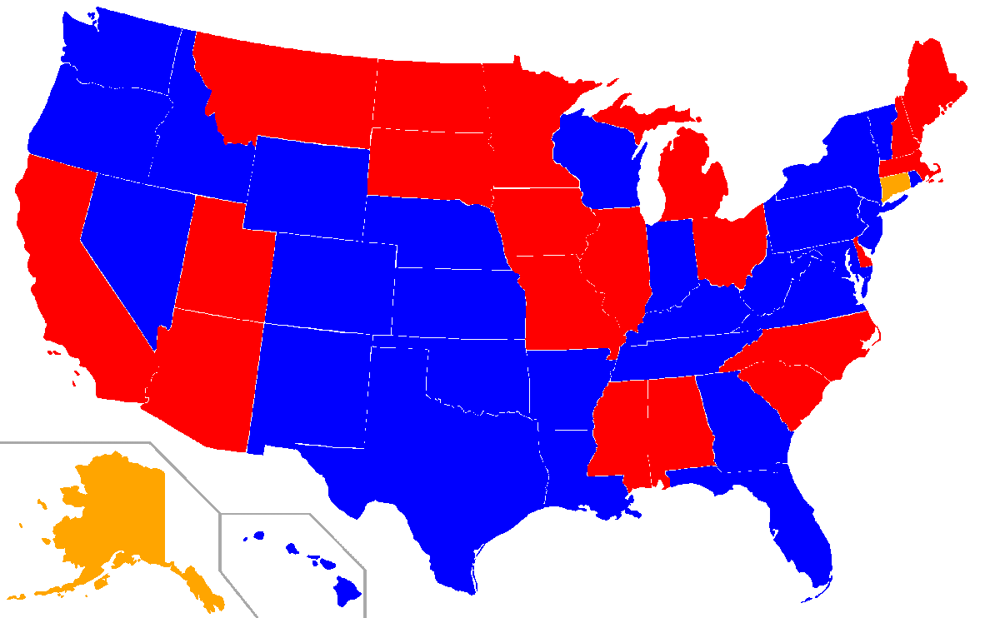

<style type="text/css">

/* Table of content - navigation */
div#TOC li {
    list-style:none;
    background-color:lightgray;
    background-image:none;
    background-repeat:none;
    background-position:0;
    font-family: Arial, Helvetica, sans-serif;
    color: #780c0c;
}


/* Title fonts */
h1.title {
  font-size: 24px;
  color: darkblue;
  text-align: center;
  font-family: Arial, Helvetica, sans-serif;
  font-variant-caps: normal;
}
h4.author { 
  font-size: 18px;
  font-family: Arial, Helvetica, sans-serif;
  color: navy;
  text-align: center;
}
h4.date { 
  font-size: 18px;
  font-family: Arial, Helvetica, sans-serif;
  color: darkblue;
  text-align: center;
}

/* Section headers */
h1 {
    font-size: 22px;
    font-family: "Times New Roman", Times, serif;
    color: darkred;
    text-align: left;
}

h2 {
    font-size: 18px;
    font-family: "Times New Roman", Times, serif;
    color: navy;
    text-align: left;
}

h3 { 
    font-size: 15px;
    font-family: "Times New Roman", Times, serif;
    color: darkred;
    text-align: left;
}

h4 {
    font-size: 18px;
    font-family: "Times New Roman", Times, serif;
    color: darkred;
    text-align: left;
}

/* Decoration of hyperlinks  */

/* unvisited link */
a:link {
  color: green;
}

/* visited link */
a:visited {
  color: purple;
}

/* mouse over link */
a:hover {
  color: red;
}

/* selected link */
a:active {
  color: yellow;
}
</style>

```{r setup, include=FALSE}
# code chunk specifies whether the R code, warnings, and output 
# will be included in the output files.

if (!require("tidyverse")) {
   install.packages("tidyverse")
   library(tidyverse)
}
if (!require("knitr")) {
   install.packages("knitr")
   library(knitr)
}
if (!require("sf")) {
   install.packages("sf")
   library(sf)
}
if (!require("terra")) {
   install.packages("terra")
   library(terra)
}
if (!require("plotly")) {
   install.packages("plotly")
   library(plotly)
}
if (!require("dplyr")) {
   install.packages("dplyr")
   library(dplyr)
}
if (!require("png")) {
    install.packages("png")             
    library("png")
}
if (!require("spData")) {
    install.packages("spData")             
    library("spData")
}
if (!require("colourpicker")) {
    install.packages("colourpicker")              
    library("colourpicker")
}
if (!require("gifski")) {
    install.packages("gifski")              
    library("gifski")
}
if (!require("magick")) {
    install.packages("magick")              
    library("magick")
}

### ggplot and extensions
if (!require("ggplot2")) {
    install.packages("ggplot2")              
    library("ggplot2")
}
if (!require("gganimate")) {
    install.packages("gganimate")              
    library("gganimate")
}

if (!require("sf")) {
    install.packages("sf")              
    library("sf")
}
if (!require("tigris")) {
    install.packages("tigris")              
    library("tigris")
}
if (!require("mapview")) {
    install.packages("mapview")              
    library("mapview")
}
if (!require("pander")) {
    install.packages("pander")              
    library("pander")
}
if (!require("lattice")) {
    install.packages("lattice")
library("lattice")
}
if (!require("sp")) {
    install.packages("sp")
library("sp")
}
if (!require("leaflet")) {
    install.packages("leaflet")
library("leaflet")
}
if (!require("leafpop")) {
    install.packages("leafpop")
library("leafpop")
}


if (!require("htmlwidgets")) {
    install.packages("htmlwidgets")
library("htmlwidgets")
}
if (!require("leaflet.extras")) {
    install.packages("leaflet.extras")
library("leaflet.extras")
}
if (!require("htmltools")) {
    install.packages("htmltools")
library("htmltools")
}
if(!require("png")){
  install.packages("png")
  library(png)
}
if(!require("viridis")){
  install.packages("viridis")
  library(viridis)
}
if(!require("ggmap")){
  install.packages("ggmap")
  library(ggmap)
}
if(!require("webshot")){
  install.packages("webshot")
  library(webshot)
}
if(!require("htmlwidgets")){
  install.packages("htmlwidgets")
  library(htmlwidgets)
}
if(!require("animation")){
  install.packages("animation")
  library(animation)
}
if(!require("gifski")){
  install.packages("gifski")
  library(gifski)
}
if(!require("htmlTable")){
  install.packages("htmlTable")
  library(htmlTable)
}
if(!require("magrittr")){
  install.packages("magrittr")
  library(magrittr)
}


if (!require("scales")) {
    install.packages("scales")              
    library("scales")
}

if (!require("tidyverse")) {
    install.packages("tidyverse")              
    library("tidyverse")
}

if (!require("dplyr")) {
    install.packages("dplyr")              
    library("dplyr")
}
if (!require("lubridate")) {
    install.packages("lubridate")              
    library("lubridate")
}
if (!require("gplots")) {
    install.packages("gplots")              
    library("gplots")
}
if (!require("leaflet")) {
    install.packages("leaflet")              
    library("leaflet")
}
if (!require("maps")) {
    install.packages("maps")              
    library("maps")
}
if (!require("htmltools")) {
    install.packages("htmltools")              
    library("htmltools")
}
if (!require("htmlwidgets")) {
    install.packages("htmlwidgets")              
    library("htmlwidgets")
}
if (!require("leaflegend")) {
    install.packages("leaflegend")              
    library("leaflegend")
}
if (!require("geojsonio")) {
    install.packages("geojsonio")              
    library("geojsonio")
}


if (!require("gapminder")) {
   install.packages("gapminder")
   library(gapminder)
}
if (!require("tidyr")) {
   install.packages("tidyr")
   library(tidyr)
}
if (!require("tidyverse")) {
   install.packages("tidyverse")
   library(tidyverse)
}
if (!require("knitr")) {
   install.packages("knitr")
   library(knitr)
}
if (!require("cowplot")) {
   install.packages("cowplot")
   library(cowplot)
}
if (!require("latex2exp")) {
   install.packages("latex2exp")
   library(latex2exp)
}
if (!require("plotly")) {
   install.packages("plotly")
   library(plotly)
}
if (!require("gapminder")) {
   install.packages("gapminder")
   library(gapminder)
}
if (!require("png")) {
    install.packages("png")             # Install png package
    library("png")
}
if (!require("RCurl")) {
    install.packages("RCurl")             # Install RCurl package
    library("RCurl")
}
if (!require("colourpicker")) {
    install.packages("colourpicker")              
    library("colourpicker")
}
if (!require("gganimate")) {
    install.packages("gganimate")              
    library("gganimate")
}
if (!require("gifski")) {
    install.packages("gifski")              
    library("gifski")
}
if (!require("magick")) {
    install.packages("magick")              
    library("magick")
}
if (!require("grDevices")) {
    install.packages("grDevices")              
    library("grDevices")
}
if (!require("jpeg")) {
    install.packages("jpeg")              
    library("jpeg")
}
if (!require("VGAM")) {
    install.packages("VGAM")              
    library("VGAM")
}
if (!require("MASS")) {
    install.packages("MASS")              
    library("MASS")
}
if (!require("nnet")) {
    install.packages("nnet")              
    library("nnet")
}
if (!require("cluster")) {
    install.packages("cluster")              
    library("cluster")
}
if (!require("dplyr")) {
    install.packages("dplyr")              
    library("dplyr")
}
if (!require("odbc")) {
   install.packages("odbc")
   library(odbc)
}
if (!require("DBI")) {
   install.packages("DBI")
   library(DBI)
}
if (!require("RSQLite")) {
   install.packages("RSQLite")
   library(RSQLite)
}

if (!require("tidyverse")) {
   install.packages("tidyverse")
   library(tidyverse)
}
if (!require("data.table")) {
   install.packages("data.table")
   library(data.table)
}


# knitr::opts_knit$set(root.dir = "C:\\STA490\\w05")
knitr::opts_chunk$set(echo = TRUE,       
                      warning = FALSE,   
                      result = TRUE,   
                      message = FALSE,
                      comment = NA)

db <- dbConnect(RSQLite::SQLite(), dbname = "sql.sqlite")
knitr::opts_chunk$set(connection = "db")


```


# Introduction 

In order to properly design a map data visualization, it is important to understand some general visualization theory: variable data types. Variable data types determine the different visualization encodings that can be used for the data. We will introduce choropleth map with a practical example.


# Choropleth Maps

Report on metrics such as consumer demographics, sales performance, or population density by market segment is how to illustrate the data in a way that the target audience can understand. Choropleth maps are one of the most popular and effective methods in this regard.

```{r ,echo = FALSE}
knitr:: 
```


## Case Example 1
Based on raw files, we want to know the winning parties in counties the presidential election across every four years.

### Data Preparation 

There are 2 raw data available on the Github website, including “fips2geocode” file and “PresidentialElection2000To2020” file. The “fips2geocode” file contains latitude and longitude data by each counties level.  We will combine “election” file and “fips2geocode” file to get our final dataset. In addition, if the latitude and longitude of the subdataset are missing, the observation will be excluded. Finally, we are getting information about winner's candidates. The total number of votes and percentage of the total votes are calculated by each counties level. 


```{r}


P_election_all = read.csv("https://raw.githubusercontent.com/GUANTSERN-KUO/webcv/main/w09/PresidentialElection2000To2020.csv") 

```


```{r}

# read FIPS file
FIPS = read.csv("https://raw.githubusercontent.com/GUANTSERN-KUO/webcv/main/w08/fips2geocode.csv")
# read election file


P_election_all = read.csv("https://raw.githubusercontent.com/GUANTSERN-KUO/webcv/main/w09/PresidentialElection2000To2020.csv") %>%

 #CONSOLIDATE VOTES OF ALL MODES
  group_by(year, state_po, county_name, county_fips, party,candidate) %>% 
  summarize(total.candidatevotes = sum(candidatevotes), total.votes = mean(totalvotes)) %>% 

 
  group_by(year, county_fips) %>% 
  filter(total.candidatevotes == max(total.candidatevotes, na.rm = TRUE)) %>% 
  
  mutate(winner.pct = percent(total.candidatevotes/total.votes)) %>%
  
  
  
  dplyr::select(c('year','state_po', 'county_name', 'county_fips', 'party', 'total.candidatevotes', 'winner.pct', 'candidate' ))
  

```


```{r}

#Create database
con <- dbConnect(drv = SQLite(),
                 dbname = ":memory:")

#store sample data in database
dbWriteTable(conn = con, 
             name = "P_election_all",
             value = P_election_all)

dbWriteTable(conn = con, 
             name = "FIPS",
             value = FIPS)

```


```{sql, connection = "con", output.var = "final_county"} 
SELECT a.*, b.lon, b.lat
FROM P_election_all AS A
LEFT JOIN FIPS AS B
ON A.county_fips = B.fips  ;
```

```{r}
final_county <- filter(final_county,!is.na(lon)) # remove missing obs
```

### Result 

The following outputs is created by using Tableau tool.
From year 2000 to the year 2020 presidential election, the majority number of winning counties are Republicans. On the East Coast and West Coast areas, most of the winning counties are Democrats.


```{r}

# Writing data to a CSV file
write.csv(final_county, "P_election_county.csv")


```


<table border = 0 bordercolor="darkgreen" bgcolor='#f6f6f6'  width=100%  align = center>
<tr>
<td>


<div class='tableauPlaceholder' id='viz1712076908319' style='position: relative'>
<noscript><a href='#'></a>

</noscript><object class='tableauViz'  style='display:none;'>
<param name='host_url' value='https%3A%2F%2Fpublic.tableau.com%2F' /> 
<param name='embed_code_version' value='3' /> 
<param name='path' value='shared&#47;8QBPMS646' /> 
<param name='toolbar' value='yes' />
<param name='static_image' value='https:&#47;&#47;public.tableau.com&#47;static&#47;images&#47;8Q&#47;8QBPMS646&#47;1.png' /> 
<param name='animate_transition' value='yes' />
<param name='display_static_image' value='yes' />
<param name='display_spinner' value='yes' />
<param name='display_overlay' value='yes' />
<param name='display_count' value='yes' />
<param name='language' value='en-US' />


</object></div>                

<script type='text/javascript'>                   
 var divElement = document.getElementById('viz1712076908319');                   
 var vizElement = divElement.getElementsByTagName('object')[0];                    
vizElement.style.width='100%';vizElement.style.height=(divElement.offsetWidth*0.75)+'px';                    
var scriptElement = document.createElement('script');       scriptElement.src = 'https://public.tableau.com/javascripts/api/viz_v1.js';                    vizElement.parentNode.insertBefore(scriptElement, vizElement);                

</script>


</td>
</tr>
</table>


## Case Example 2
Based on raw files, we want to know the winning parties in "state level" the presidential election across every four years.

### Data Preparation 


Same data preparation as in Example 1. However, We'd like to know the total number of votes in the presidential election using state-level. Then, we calculate the percentage of the total votes in each state.

```{r}

P_election_state = read.csv("https://raw.githubusercontent.com/GUANTSERN-KUO/webcv/main/w09/PresidentialElection2000To2020.csv")

P_election_state <- filter(P_election_state,!is.na(candidatevotes)) # remove missing obs

```


```{r}

  P_election_party_tot  <- P_election_state  %>%

 #CONSOLIDATE VOTES OF ALL MODES
  group_by(year, state_po, party ) %>% 
  summarize(total.candidatevotes = sum(candidatevotes))
```
```{r}
P_election_state_tot  <- P_election_state   %>%

 #CONSOLIDATE VOTES OF ALL MODES
  group_by(year, state_po ) %>% 
  summarize(totalstatevotes = sum(candidatevotes))


```


```{r}

#Create database
con <- dbConnect(drv = SQLite(),
                 dbname = ":memory:")

#store sample data in database
dbWriteTable(conn = con, 
             name = "P_election_party_tot",
             value = P_election_party_tot)

dbWriteTable(conn = con, 
             name = "P_election_state_tot",
             value = P_election_state_tot)

```


```{sql, connection = "con", output.var = "state_num"} 
SELECT a.*, b.totalstatevotes
FROM P_election_party_tot AS A
LEFT JOIN P_election_state_tot AS B
ON A.year = B.year and A.state_po = B.state_po  ;
```


```{r}
  
final_state <- state_num  %>%

group_by(year, state_po) %>% 
  filter(total.candidatevotes == max(total.candidatevotes, na.rm = TRUE)) %>% 
  
  mutate(winner.pct = percent(total.candidatevotes/totalstatevotes)) %>%
  
  
  
  dplyr::select(c('year','state_po', 'party', 'total.candidatevotes', 'winner.pct' ))
  

```


### Result 


The following outputs is created by using Tableau tool.
From year 2000 to the year 2020 presidential election, on the East Coast and West Coast areas, the majority number of winning states are Democrats. In the middle area, the majority number of winning states are Republican. In the year 2004 presidential election, Republicans won significantly more states than Democrats.


<table border = 0 bordercolor="darkgreen" bgcolor='#f6f6f6'  width=100%  align = center>
<tr>
<td>


<div class='tableauPlaceholder' id='viz1712087343817' style='position: relative'>
<noscript><a href='#'></a>

</noscript><object class='tableauViz'  style='display:none;'>
<param name='host_url' value='https%3A%2F%2Fpublic.tableau.com%2F' /> 
<param name='embed_code_version' value='3' /> 
<param name='path' value='shared&#47;KBW4MWX7T' /> 
<param name='toolbar' value='yes' /><
param name='static_image' value='https:&#47;&#47;public.tableau.com&#47;static&#47;images&#47;KB&#47;KBW4MWX7T&#47;1.png' /> 
<param name='animate_transition' value='yes' />
<param name='display_static_image' value='yes' />
<param name='display_spinner' value='yes' />
<param name='display_overlay' value='yes' />
<param name='display_count' value='yes' />
<param name='language' value='en-US' />

</object></div>                
<script type='text/javascript'>                    
 var divElement = document.getElementById('viz1712087343817');                    
 var vizElement = divElement.getElementsByTagName('object')[0];                    
vizElement.style.width='100%';vizElement.style.height=(divElement.offsetWidth*0.75)+'px';                    
var scriptElement = document.createElement('script');    scriptElement.src = 'https://public.tableau.com/javascripts/api/viz_v1.js';    vizElement.parentNode.insertBefore(scriptElement, vizElement);                

</script>


</td>
</tr>
</table>

```{r}

# Writing data to a CSV file
write.csv(final_state, "P_election_state.csv")


```


